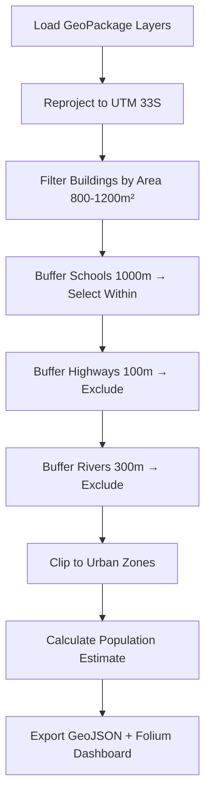

# QGIS + AI: Automated Site Selection Demo

[](https://qgis.org)
[](https://python.org)
[](https://python-visualization.github.io/folium/)
[](https://youtube.com/@Saltco_GeoTraining)
[](LICENSE)
[](https://docs.qgis.org/latest/en/docs/training_manual/)

> One command. 7 data layers. 6 criteria. 9 suitable sites. **25 seconds.**
> Dataset: QGIS Training Manual (exercise_data) · Data © OpenStreetMap contributors · ODbL

---

📺 **Watch the demo:** [youtube.com/@Saltco_GeoTraining](https://youtube.com/@Saltco_GeoTraining)
🌐 **Portfolio:** [saltcotraining-geoai.github.io](https://saltcotraining-geoai.github.io)
📦 **Company:** Saltibin for Training & Capacity Building

---

##  What This Demo Shows

This is a complete automated site selection workflow using **QGIS in headless mode** + **PyQGIS Processing algorithms** + **Folium web maps**.

**The Problem:** Find buildings that meet all these criteria:
1. Area between **800 and 1200 m²**
2. Within **1000m of a school**
3. NOT within **100m of a main highway**
4. NOT within **300m of a river**
5. Inside a **residential urban zone**
6. Calculate **population estimate**

**The Result:** From **4,708 buildings** → **9 suitable sites** — automatically.

---

##  Quick Start

### Prerequisites

| Dependency | Check |
|-----------|-------|
| QGIS 3.x | `qgis --version` |
| Python 3 | `python3 --version` |
| Folium | `pip install folium --break-system-packages` |
| GDAL | Included with QGIS |

### Run the Demo

```bash
# One command — runs all 3 phases
python3 demo.py
```

Or run phases individually:

```bash
# Phase 1: Load data + build web map
python3 phase1_webmap.py

# Phase 2: Run spatial analysis
python3 phase2_site_selection.py

# Phase 3: Generate showcase dashboard
python3 phase3_showcase.py
```

After running, open `phase3_dashboard.html` in your browser.

---

##  Output Files

| File | Size | Description |
|------|------|-------------|
| `phase3_dashboard.html` | ~1.4 MB | **Showcase dashboard** — interactive map, data table, exports |
| `phase2_site_selection.html` | ~1.4 MB | Analysis result map with exclusion zones |
| `phase1_webmap.html` | ~66 MB | Raw data visualization (all 7 layers + satellite) |
| `suitable_sites.geojson` | ~16 KB | Final 9 candidate sites (GeoJSON) |

### Dashboard Features

- **Stats cards** — see the filtering cascade at a glance
- **Interactive map** — green = suitable sites, overlays for exclusion zones
- **Filter funnel** — visual bar chart of the selection process
- **Data table** — searchable, sortable, paginated site register
- **Export CSV** — one-click download
- **Export GeoJSON** — one-click download
- **Print / PDF** — Ctrl+P → "Save as PDF" for professional reports

---

##  Dataset

| Layer | Type | Features | Source |
|-------|------|----------|--------|
| `buildings.gpkg` | Polygon | 4,708 | OpenStreetMap |
| `schools.gpkg` | Polygon | 4 | OpenStreetMap |
| `roads.gpkg` | Line | 717 | OpenStreetMap |
| `rivers.gpkg` | Line | 19 | OpenStreetMap |
| `urban.gpkg` | Polygon | 6 | OpenStreetMap |
| `water.gpkg` | Polygon | 37 | OpenStreetMap |
| `restaurants.gpkg` | Polygon | 11 | OpenStreetMap |
| `satellite_image.tif` | Raster | 3714×3012 | Satellite/drone imagery |

Study area: **Cape Agulhas, South Africa** (approx 20.44°E, -34.02°S)
CRS: EPSG:4326 (WGS 84) / EPSG:32733 (UTM 33S)

**Dataset sourced from [QGIS Training Manual](https://docs.qgis.org/latest/en/docs/training_manual/) exercise_data.**
Original data © [OpenStreetMap contributors](https://openstreetmap.org/copyright) (ODbL).

---

##  How It Works



**Key PyQGIS algorithms used:**
- `native:reprojectlayer` — CRS transformation
- `native:fieldcalculator` — $area calculation
- `native:extractbyexpression` — attribute filter
- `native:buffer` — distance buffering
- `native:extractbylocation` — spatial selection (intersect/disjoint)
- `native:fixgeometries` — geometry validation

---

##  License & Attribution

**Code:** MIT — free to use, modify, and share.

**Dataset:** Sourced from the [QGIS Training Manual](https://docs.qgis.org/latest/en/docs/training_manual/) exercise_data.
Original data © [OpenStreetMap contributors](https://openstreetmap.org/copyright) — licensed under [ODbL](https://opendatacommons.org/licenses/odbl/).
Contains information from the QGIS project (CC-BY-SA).

---

##  Connect

**YouTube:** [youtube.com/@Saltco_GeoTraining](https://youtube.com/@Saltco_GeoTraining)
**GitHub:** [github.com/saltcotraining-geoai/qgis-ai-site-selection](https://github.com/saltcotraining-geoai/qgis-ai-site-selection)
**Portfolio:** [saltcotraining-geoai.github.io](https://saltcotraining-geoai.github.io)
**Company:** Saltco for Training & Capacity Building
**Email:** saltco.training@gmail.com

*"The best GIS analyst is the one who automates their workflow."*
